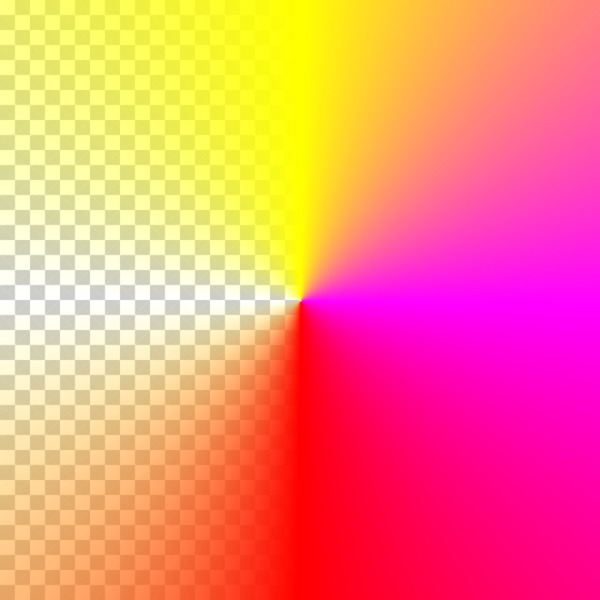

# canvas-sweep-gradient

This is an attempt to render a multi-stop gradient that fills by sweeping around a circle, rather than the “bulls-eye” effect that is generated by `CanvasRenderingContext2D.createRadialGradient`.

## Example output

