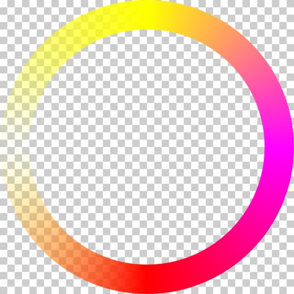

[](https://bundlephobia.com/result?p=canvas-sweep-gradient)

# canvas-sweep-gradient

This is an attempt to render a multi-stop gradient that fills by sweeping around a circle, rather than the “bulls-eye” effect that is generated by `CanvasRenderingContext2D.createRadialGradient`.

## Example output

### Draw a gradient


```js
const displayElement = document.querySelector("#demo");

/**
 * Width and height attributes are required on the canvas element.
 */
const displayRect = displayElement.getBoundingClientRect();
const width = displayRect.width;
const height = displayRect.height;
displayElement.width = width;
displayElement.height = height;

/**
 * Setup and draw the gradient.
 */
const ctx = displayElement.getContext("2d");
const x0 = 0;
const y0 = 0;
const x1 = width;
const y1 = height;
const g = new SweepGradient.SweepGradient(ctx, x0, y0, x1, y1);

/**
 * Add colours, the same as CanvasRenderingContext2D.createLinearGradient
 */
g.addColorStop(0.0, "#ff0");
g.addColorStop(0.25, "#ff00ff");
g.addColorStop(0.5, "red");
g.addColorStop(0.75, "rgba(255,255,0,0)");
g.addColorStop(1.0, "#ffff00");

/**
 * Draw the gradient
 */
g.draw();
```

### Use as a canvas pattern

See the [demo folder](./demo/) for an example of creating a gradient to use as a pattern fill.


